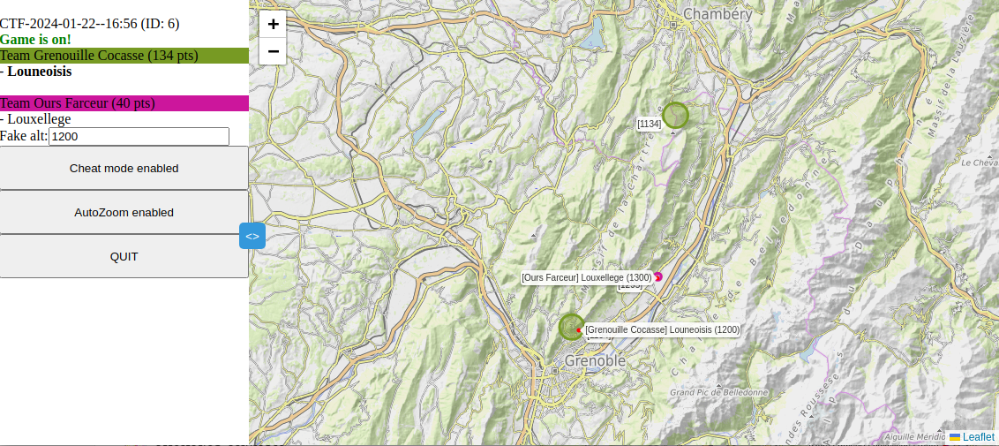
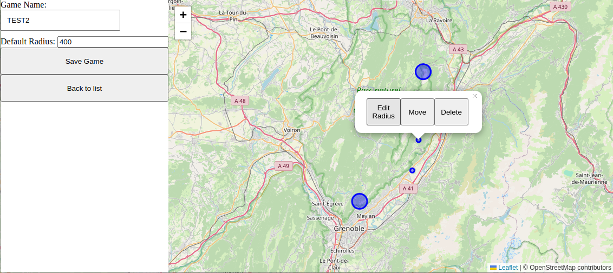
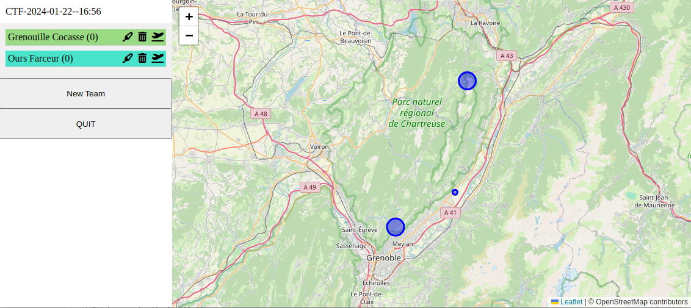

# ParaCTF - A IRL Paragliding CTF game

## Rules
These are classical ctf rules applied to (real) paragliding. A game is set with flags (sort-of-competition-turnpoints : cylinders centered on a point with a certain radius). Teams join a game, Pilots join a Team. Once a team member enters a flag zone, he/her captures it for his/her team. The flags can be retaken by another team, depending on the scoring model in place for the current game. A scoring system is attached to the game to calculate the scores and flag statuses (same principle as if a "Race to goal" or "Elapsed time" scoring system is attached to a competition task).

The game page screenshot:

## Models
### Games

Models are sort of competition tasks with only the turnpoints (without times nor teams, nor scoring system defined). This was meant to save interesting tasks (tactical positions) for future games.

Game model editor

### CTF

CTF (called ***igames*** in the code, url and some other places) are Game instances on a Game Model. Teams can be added.
CTF are planned for 3 hours for now, but that's already a variable somewhere

CTF setup, team creation:

### Teams
Teams are made of members. No limit on the number of Teams / Igame. They're defined by name & color, that will be reflected on the flag once they capture one.

### Team Members + location History
Mostly explicit. These are the pilots. Not that each one receive a unique password when joining a game, that will act as a vlaidation key for updating his/her position.

### Scoring systems
#### Introduction
Scoring systems are abstracted for evolution. For now 2 are available.
In general, implementing a scoring system requires to implement 2 functions:
- score_latest_update > get a quick latest update for the client's view to update (especially on Flags' statuses)
- score_igame > Get teams's final score (or at least the latest ones)

Note there is a parent scoring class that implements a bunch of helpful methods, for instance checking if a pilot's GPS location is within a flag cylinder.
  
#### trad
The last team member in a flag will give the flag to his or her team, and store pilot's altitude in the flag. Anohter pilot can take over this flag only if his/her altitude is above the previous one.
1pt/sec once for each captured flag for a team, as long as the flag belongs to them

#### degress
Almost the same rule, but once the last pilot of a team leaves the flag, the stored altitude will decrease by 1 meter every second (the goal is to give more chance to recapture, or simply take into account the flying condition that may change during the game (for instance cloud base getting lower)
The same 1pt/sec for each captured flag for a team, as long as the flag belongs to them.

## Development 

### Front
JS/ajax code + Leaflet. position & altitude taken from the navigator.geolocation.getCurrentPosition() builtin method.
Dedicated pages for each step (landing page/editor/igame creation/play) with ***a lot*** of code redundancy there.

### Back
A flask/python backend, using SQLAlchemy as ORM over a SQLITE3 file DB. Sounds OK but would also require a bit of cleaning and ordering.
Basically :
- an app.py flask receiving requests and dispatching to a sort-of-controller
- a game.py controller
- a models.py model code
- a game.db sqlite3 DB file. So far it seems to be efficient with a couple of thousands locations histories

### Running it
NGINX configured for serving
- the static web/ directory on an exposed static/ directory in the URL
- the api through an RP mapping to the flask app running in another process.

This works fine.

### Note
Most of the code was produced by ChatGPT.

### TODO
- The front part needs a big redesign / code refactoring. PR welcome.
    - Redo left menu with unifed Look&Feel
    - a bit of code refactoring for the map view which is almost duplicated between the different pages.
- CTF Creation : new params to take into account (time to play, scoring method...)
- maybe lock on Igames once they started, and an explicit start button
- position caching (+timestamp) when server (or data network !) is unavailable for a while
- client's data is very much trusted, for pure game data but also for the technical stuff. As i'm not an expert in SQLalchemy but that raises a couple of security issues to me.
- Improve Member auto-naming
- Dockerfile to facilitate the deployments for the backend
